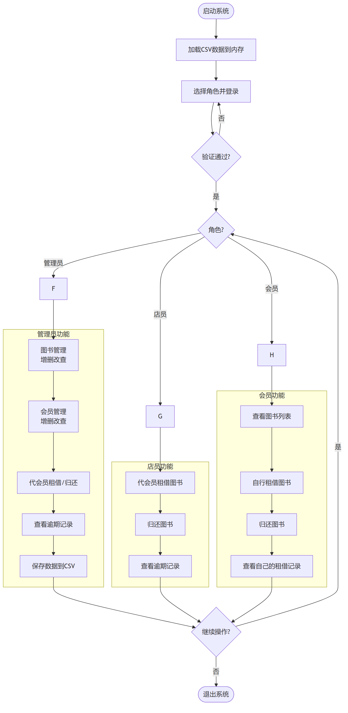
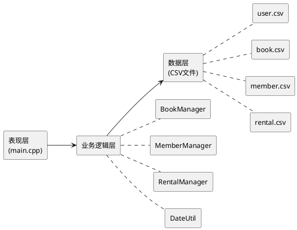

# 租书店管理系统 - 业务流程图

## 综合项目主流程



---

## 1. 系统登录流程

```plantuml
@startuml
left to right direction

mxgraph.bpmn.event.start "开始" as start
rectangle "选择角色\n(管理员/店员/会员)" as select_role
rectangle "输入账号密码" as input_cred
mxgraph.bpmn.service_task "读取 user.csv" as read_csv
mxgraph.bpmn.gateway2.exclusive "验证通过?" as verify
rectangle "显示角色菜单" as show_menu
mxgraph.bpmn.event.end "结束" as end

start --> select_role
select_role --> input_cred
input_cred --> read_csv
read_csv --> verify
verify --> show_menu : "是"
verify --> input_cred : "否(重新输入)"
show_menu --> end : "退出登录"
@enduml
```

## 2. 图书租借流程

```plantuml
@startuml
left to right direction

mxgraph.bpmn.event.start "开始" as start
rectangle "输入会员账号\n和图书ID" as input_info
mxgraph.bpmn.service_task "验证会员存在" as check_member
mxgraph.bpmn.gateway2.exclusive "会员有效?" as gw_member
mxgraph.bpmn.service_task "验证图书库存" as check_stock
mxgraph.bpmn.gateway2.exclusive "库存充足?" as gw_stock
rectangle "生成租借记录\n(记录ID=R+时间戳)" as create_record
mxgraph.bpmn.service_task "库存-1" as dec_stock
rectangle "计算应还日期\n(租借日+30天)" as calc_due
mxgraph.bpmn.data2.dataOutput "保存到 rental.csv" as save_rental
mxgraph.bpmn.event.end "结束" as end

start --> input_info
input_info --> check_member
check_member --> gw_member
gw_member --> check_stock : "是"
gw_member --> end : "否(会员不存在)"
check_stock --> gw_stock
gw_stock --> create_record : "是(库存>0)"
gw_stock --> end : "否(库存不足)"
create_record --> dec_stock
dec_stock --> calc_due
calc_due --> save_rental
save_rental --> end
@enduml
```

## 3. 图书归还流程

```plantuml
@startuml
left to right direction

mxgraph.bpmn.event.start "开始" as start
rectangle "输入租借记录ID" as input_id
mxgraph.bpmn.service_task "查找租借记录" as find_record
mxgraph.bpmn.gateway2.exclusive "记录存在\n且未归还?" as gw_valid
rectangle "设置归还日期\n= 当前日期" as set_return
mxgraph.bpmn.service_task "库存+1" as inc_stock
rectangle "计算租借费用\n= 书价×1%×天数" as calc_fee
mxgraph.bpmn.gateway2.exclusive "是否逾期?\n(>30天)" as gw_overdue
rectangle "计算逾期罚款\n= 书价×2%×逾期天数" as calc_penalty
rectangle "显示费用明细" as show_fee
mxgraph.bpmn.data2.dataOutput "更新 rental.csv" as save_data
mxgraph.bpmn.event.end "结束" as end

start --> input_id
input_id --> find_record
find_record --> gw_valid
gw_valid --> set_return : "是"
gw_valid --> end : "否(记录无效)"
set_return --> inc_stock
inc_stock --> calc_fee
calc_fee --> gw_overdue
gw_overdue --> calc_penalty : "是"
gw_overdue --> show_fee : "否"
calc_penalty --> show_fee
show_fee --> save_data
save_data --> end
@enduml
```

## 4. 会员注册流程（管理员操作）

```plantuml
@startuml
left to right direction

mxgraph.bpmn.event.start "开始" as start
rectangle "管理员选择\n添加会员" as select
rectangle "输入会员信息\n(账号/密码/姓名/手机)" as input_info
mxgraph.bpmn.gateway2.exclusive "账号重复?" as gw_dup
mxgraph.bpmn.service_task "写入 member.csv" as save_member
rectangle "自动生成登录账号\n(role=3)" as gen_account
mxgraph.bpmn.service_task "写入 user.csv" as save_user
mxgraph.bpmn.event.end "结束" as end

start --> select
select --> input_info
input_info --> gw_dup
gw_dup --> input_info : "是(重新输入)"
gw_dup --> save_member : "否"
save_member --> gen_account
gen_account --> save_user
save_user --> end
@enduml
```

## 5. 系统架构总览



## 6. 角色权限矩阵

| 功能 | 管理员 | 店员 | 会员 |
|------|:------:|:----:|:----:|
| 查看图书 | ✅ | ✅ | ✅ |
| 添加/修改/删除图书 | ✅ | ❌ | ❌ |
| 管理图书分类 | ✅ | ❌ | ❌ |
| 添加/修改/删除会员 | ✅ | ❌ | ❌ |
| 代会员租书 | ✅ | ✅ | ❌ |
| 自行租书 | ❌ | ❌ | ✅ |
| 归还图书 | ✅ | ✅ | ✅ |
| 查看所有租借记录 | ✅ | ❌ | ❌ |
| 查看自己的租借记录 | ❌ | ❌ | ✅ |
| 查看逾期记录 | ✅ | ✅ | ❌ |
| 保存数据 | ✅ | ❌ | ❌ |
